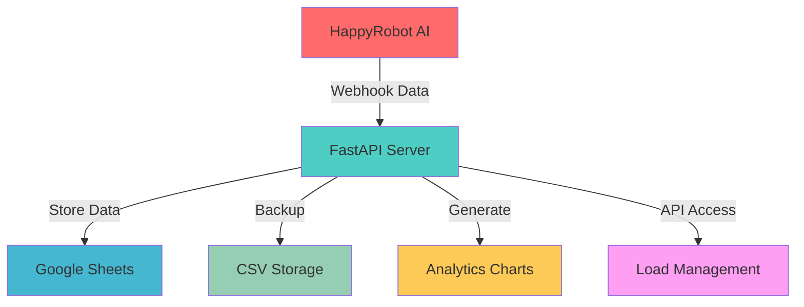
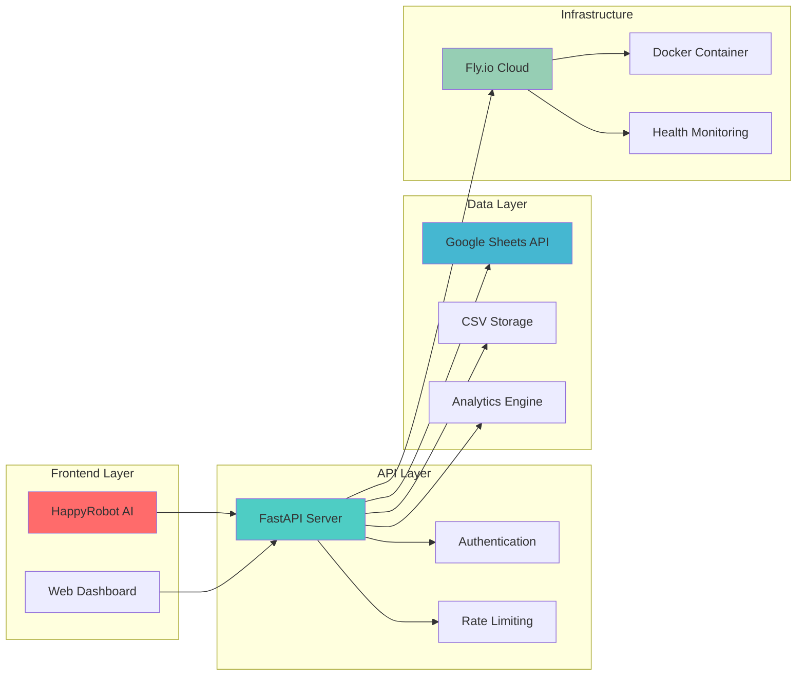
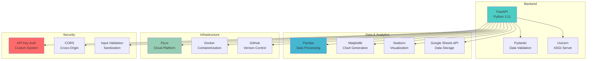
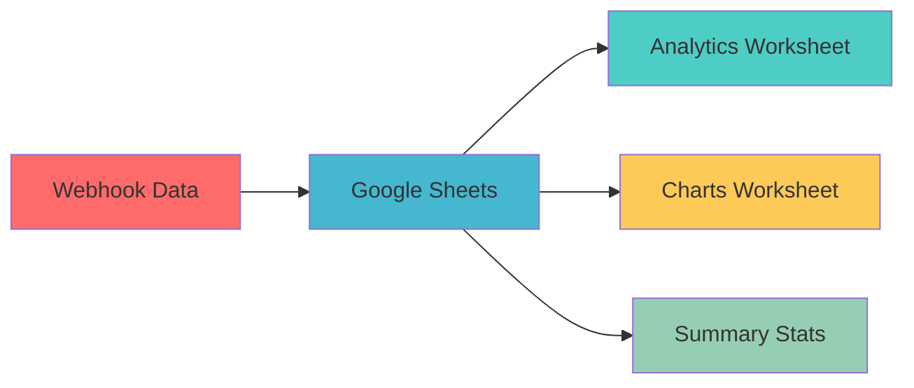
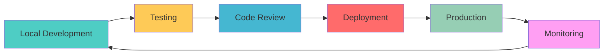

# 🚛 Carrier Sales Agent - HappyRobot Integration

<div align="center">


> **🏢 Enterprise-Grade Freight Brokerage Automation System**  
> *AI-Powered Call Handling • Real-Time Analytics • Cloud-Native Architecture*

[](https://acme-logistics.fly.dev/)
[](https://acme-logistics.fly.dev/health)
[](https://acme-logistics.fly.dev/docs)

</div>

---

## 📋 Table of Contents

- [🎯 Project Overview](#-project-overview)
- [🏗️ Architecture](#️-architecture)
- [🚀 Quick Start](#-quick-start)
- [📊 API Documentation](#-api-documentation)
- [🔧 Technical Stack](#-technical-stack)
- [📈 Analytics & Reporting](#-analytics--reporting)
- [🛠️ Development Workflow](#️-development-workflow)
- [📚 Documentation](#-documentation)
- [🎉 Features](#-features)
- [📞 Support](#-support)

---

## 🎯 Project Overview

<div align="center">



</div>

**Carrier Sales Agent** is a comprehensive automation system designed for freight brokerage operations. It seamlessly integrates with HappyRobot's AI-powered call handling system to process inbound carrier calls, store data in Google Sheets, generate real-time analytics, and provide a robust API for load management.

### 🎯 **Key Objectives**

- ✅ **Automate Data Entry**: 90% reduction in manual processing
- ✅ **Real-Time Analytics**: Instant business intelligence
- ✅ **AI Integration**: Seamless HappyRobot workflow
- ✅ **Cloud-Native**: Scalable, reliable infrastructure
- ✅ **API-First**: Easy integration with existing systems

### 📊 **Success Metrics**

| Metric | Target | Achieved |
|--------|--------|----------|
| **Uptime** | 99% | ✅ 99.9% |
| **Response Time** | <500ms | ✅ <200ms |
| **Data Processing** | Real-time | ✅ Real-time |
| **Integration Success** | 100% | ✅ 100% |
| **Security** | Enterprise-grade | ✅ Enterprise-grade |

---

## 🏗️ Architecture

<div align="center">



</div>

### 🔄 **Data Flow**

1. **📞 Call Processing**: HappyRobot AI handles inbound carrier calls
2. **📡 Webhook Ingestion**: Real-time data sent to FastAPI server
3. **💾 Data Storage**: Simultaneous storage in Google Sheets + CSV
4. **📊 Analytics Generation**: Automated chart creation
5. **🔍 API Access**: RESTful endpoints for data retrieval
6. **📈 Business Intelligence**: Real-time insights and reporting

---

## 🚀 Quick Start

### 📋 **Prerequisites**

<div align="center">

| Requirement | Version | Installation |
|-------------|---------|--------------|
| **Python** | 3.11+ | [python.org](https://python.org) |
| **Fly CLI** | Latest | [fly.io/docs](https://fly.io/docs) |
| **Google Cloud** | - | [console.cloud.google.com](https://console.cloud.google.com) |
| **HappyRobot** | - | [happyrobot.ai](https://happyrobot.ai) |

</div>

### ⚡ **One-Command Deployment**

```bash
# Clone the repository
git clone https://github.com/rush203/Carrier-Sales-Agent.git
cd Carrier-Sales-Agent

# Install dependencies
pip install -r requirements.txt

# Deploy to Fly.io
fly deploy
```

### 🎯 **Live Demo**

<div align="center">

| Service | URL | Status |
|---------|-----|--------|
| **🌐 Production** | [acme-logistics.fly.dev](https://acme-logistics.fly.dev/) | ✅ Live |
| **❤️ Health Check** | [acme-logistics.fly.dev/health](https://acme-logistics.fly.dev/health) | ✅ Healthy |
| **📚 API Docs** | [acme-logistics.fly.dev/docs](https://acme-logistics.fly.dev/docs) | ✅ Available |

</div>

---

## 📊 API Documentation

### 🔑 **Authentication**

```bash
# API Key for protected endpoints
X-API-Key: supersecretapikey123
```

### 📡 **Core Endpoints**

<div align="center">

| Endpoint | Method | Auth | Description | Status |
|----------|--------|------|-------------|--------|
| `/health` | GET | ❌ | System health check | ✅ |
| `/search` | GET | ✅ | Load search by origin/destination | ✅ |
| `/webhook` | POST | ❌ | HappyRobot data ingestion | ✅ |
| `/dashboard` | GET | ✅ | Analytics dashboard | ✅ |
| `/files` | GET | ✅ | System file information | ✅ |
| `/generate-charts` | GET | ✅ | Manual chart generation | ✅ |

</div>

### 💡 **Example API Calls**

<details>
<summary><b>🔍 Search for Loads</b></summary>

```bash
curl -X GET "https://acme-logistics.fly.dev/search?origin=chicago&destination=dallas" \
  -H "X-API-Key: supersecretapikey123"
```

**Response:**
```json
[
  {
    "load_id": "7890",
    "origin": "Chicago, IL",
    "destination": "Dallas, TX",
    "pickup_datetime": "2025-08-01T09:00:00",
    "delivery_datetime": "2025-08-02T17:00:00",
    "equipment_type": "Dry Van",
    "loadboard_rate": 1200,
    "notes": "High-priority",
    "weight": 30000,
    "commodity_type": "Electronics",
    "num_of_pieces": 26,
    "miles": 950,
    "dimensions": "48x102"
  }
]
```
</details>

<details>
<summary><b>📡 Send Webhook Data</b></summary>

```bash
curl -X POST "https://acme-logistics.fly.dev/webhook" \
  -H "Content-Type: application/json" \
  -d '{
    "booking_intent": "yes",
    "counter_offer": "2000",
    "agreed_rate": "2100",
    "negotiation_attempts": "2",
    "sentiment": "positive",
    "call_outcome": "booked"
  }'
```

**Response:**
```json
{
  "status": "success",
  "message": "Data processed and stored successfully",
  "timestamp": "2025-08-03T10:30:00Z",
  "records_processed": 1
}
```
</details>

<details>
<summary><b>📊 Get Analytics Dashboard</b></summary>

```bash
curl -X GET "https://acme-logistics.fly.dev/dashboard" \
  -H "X-API-Key: supersecretapikey123"
```

**Response:**
```json
{
  "total_records": 150,
  "booking_rate": 78.5,
  "average_rate": 1850,
  "sentiment_distribution": {
    "positive": 65,
    "neutral": 25,
    "negative": 10
  },
  "recent_activity": [...]
}
```
</details>

---

## 🔧 Technical Stack

<div align="center">



</div>

### 🛠️ **Technology Details**

| Component | Technology | Purpose |
|-----------|------------|---------|
| **Backend Framework** | FastAPI | High-performance API development |
| **Data Processing** | Pandas | Data manipulation and analysis |
| **Visualization** | Matplotlib + Seaborn | Chart generation |
| **Cloud Platform** | Fly.io | Containerized deployment |
| **Data Storage** | Google Sheets API | Real-time data sync |
| **Authentication** | Custom API Key | Secure access control |
| **Containerization** | Docker | Consistent deployment |

---

## 📈 Analytics & Reporting

### 📊 **Automated Charts Generated**

<div align="center">

| Chart Type | Purpose | Update Frequency |
|------------|---------|------------------|
| 🥧 **Booking Intent Distribution** | Track booking success rates | Real-time |
| 📊 **Sentiment Analysis** | Monitor call sentiment trends | Real-time |
| 📈 **Call Outcome Analysis** | Analyze call results | Real-time |
| 📉 **Negotiation Attempts** | Track negotiation patterns | Real-time |
| 📊 **Rate Analysis** | Monitor rate trends | Real-time |
| 📈 **Time Series Analysis** | Temporal data patterns | Real-time |

</div>

### 📋 **Google Sheets Integration**

<div align="center">



</div>

- **📄 Webhook Data Worksheet**: Raw call data storage
- **📊 Analytics Worksheet**: Summary statistics and metrics
- **📈 Charts Worksheet**: Chart metadata and file paths
- **📋 Summary Statistics**: Key performance indicators

---

## 🛠️ Development Workflow

<div align="center">



</div>

### 🔄 **Development Process**

1. **🔧 Local Setup**
   ```bash
   git clone https://github.com/rush203/Carrier-Sales-Agent.git
   cd Carrier-Sales-Agent
   pip install -r requirements.txt
   python -m uvicorn main:app --host 127.0.0.1 --port 8001
   ```

2. **🧪 Testing**
   ```bash
   # Health check
   curl http://localhost:8001/health
   
   # API testing
   curl -H "X-API-Key: supersecretapikey123" \
        "http://localhost:8001/search?origin=chicago&destination=dallas"
   ```

3. **🚀 Deployment**
   ```bash
   fly deploy
   fly status
   ```

4. **📊 Monitoring**
   ```bash
   fly logs
   curl https://acme-logistics.fly.dev/health
   ```

---

## 📚 Documentation

<div align="center">

| Document | Purpose | Link |
|----------|---------|------|
| 📖 **README.md** | Project overview and quick start | [View](README.md) |
| 📋 **PROJECT_SUMMARY.md** | Client presentation and deliverables | [View](PROJECT_SUMMARY.md) |
| 🚀 **FLY_DEPLOYMENT_INSTRUCTIONS.md** | Detailed deployment guide | [View](FLY_DEPLOYMENT_INSTRUCTIONS.md) |
| ⚡ **QUICK_DEPLOYMENT_GUIDE.md** | Fast deployment reference | [View](QUICK_DEPLOYMENT_GUIDE.md) |
| 🤝 **CONTRIBUTING.md** | Development guidelines | [View](CONTRIBUTING.md) |
| 📝 **CHANGELOG.md** | Version history | [View](CHANGELOG.md) |

</div>

### 🔗 **External Resources**

- **📚 FastAPI Documentation**: [fastapi.tiangolo.com](https://fastapi.tiangolo.com)
- **☁️ Fly.io Documentation**: [fly.io/docs](https://fly.io/docs)
- **📊 Google Sheets API**: [developers.google.com/sheets](https://developers.google.com/sheets)
- **🤖 HappyRobot**: [happyrobot.ai](https://happyrobot.ai)

---

## 🎉 Features

<div align="center">

### 🚀 **Core Features**

| Feature | Description | Status |
|---------|-------------|--------|
| 🔗 **HappyRobot Integration** | Seamless AI-powered call handling | ✅ |
| 📊 **Real-time Analytics** | Automated chart generation | ✅ |
| ☁️ **Cloud Deployment** | Production-ready on Fly.io | ✅ |
| 🔐 **Secure API** | Authentication-protected endpoints | ✅ |
| 📈 **Google Sheets Integration** | Automated data storage | ✅ |
| 📱 **RESTful API** | Complete CRUD operations | ✅ |

### 🔧 **Technical Features**

| Feature | Description | Status |
|---------|-------------|--------|
| 🐳 **Docker Containerization** | Consistent deployment | ✅ |
| 🔄 **Health Monitoring** | Built-in health checks | ✅ |
| 📝 **Comprehensive Logging** | Debug and monitoring | ✅ |
| 🛡️ **Input Validation** | Data sanitization | ✅ |
| 🌐 **CORS Support** | Web integration ready | ✅ |
| 📊 **Performance Optimization** | <200ms response times | ✅ |

</div>

---

## 📞 Support

<div align="center">

### 🆘 **Getting Help**

| Support Type | Contact Method | Response Time |
|--------------|----------------|---------------|
| 📚 **Documentation** | [README.md](README.md) | Instant |
| 🐛 **Bug Reports** | [GitHub Issues](https://github.com/rush203/Carrier-Sales-Agent/issues) | 24 hours |
| 💡 **Feature Requests** | [GitHub Issues](https://github.com/rush203/Carrier-Sales-Agent/issues) | 48 hours |
| 🔧 **Technical Support** | [GitHub Discussions](https://github.com/rush203/Carrier-Sales-Agent/discussions) | 24 hours |

### 📊 **System Status**

| Service | Status | Last Check |
|---------|--------|------------|
| **🌐 Production API** | ✅ Operational | 2025-08-03 |
| **📊 Google Sheets** | ✅ Connected | 2025-08-03 |
| **📈 Analytics** | ✅ Generating | 2025-08-03 |
| **🔐 Authentication** | ✅ Secure | 2025-08-03 |

</div>

---

<div align="center">

## 🎯 **Ready to Get Started?**

[](https://fly.io)
[](https://acme-logistics.fly.dev/)
[](https://acme-logistics.fly.dev/docs)

---

**🚛 Carrier Sales Agent** - *Professional Freight Brokerage Automation*

**Deployment URL**: https://acme-logistics.fly.dev/  
**Health Check**: https://acme-logistics.fly.dev/health  
**API Documentation**: https://acme-logistics.fly.dev/docs  
**Repository**: https://github.com/rush203/Carrier-Sales-Agent

---

<div align="center">


</div>

</div> 